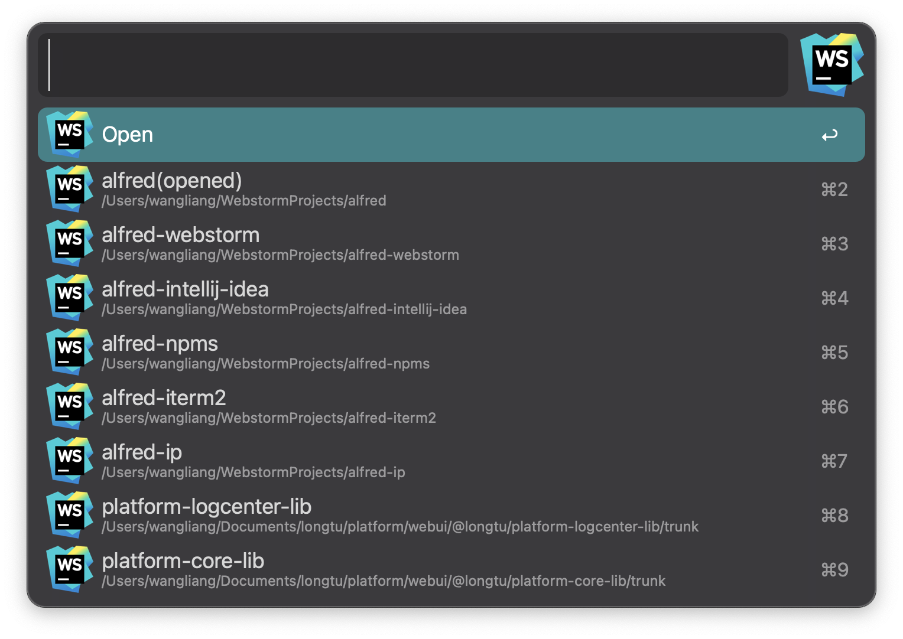
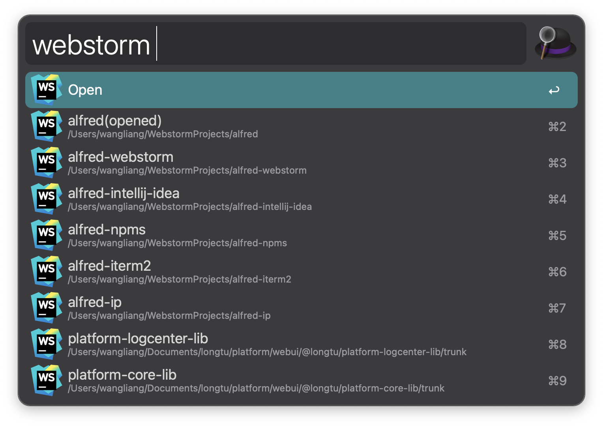

## @liangshen/alfred-webstorm

*Alfred工作流，快速启动WebStorm软件中打开过的项目*
*Alfred workflow for WebStorm*

### 运行环境

* MacOS
* Nodejs 14.x.x
* Alfred Powerpack
* WebStorm

### 安装

```
npm i -g @liangshen/alfred-webstorm
```

### 使用方法

可使用 option + W 快捷键调出WebStorm工作流搜索框(或者调出alfred搜索框输入关键字 webstorm)

回车可使用Webstorm打开项目, 按住Command键回车可在Finder中打开项目





